# Hands-On with Terraform and Ansible

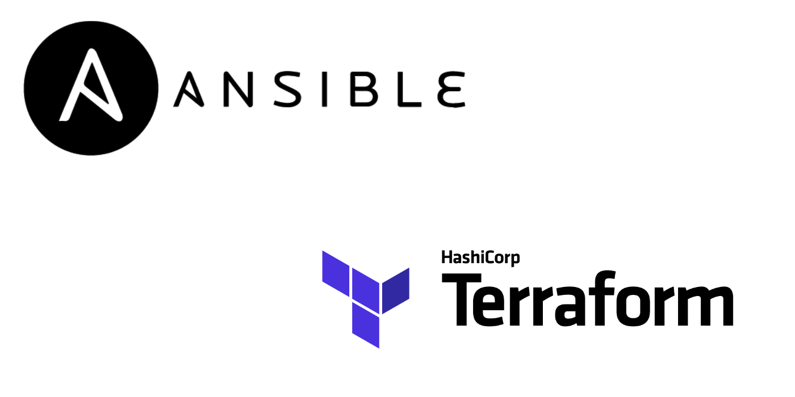

- [Overview](#overview)
- [Hands On](#hands-on)
    - [Pre-check](#pre-check)
        - [Check instance is running](#check-instance-is-running)
        - [Check terraform on instance](#check-terraform-on-instance)
        - [Check ansible on instance](#check-ansible-on-instance)
    - [Using terraform](#using-terraform)
        - [Running a terraform plan & apply](#running-a-terraform-plan-and-apply)
        - [Updating outputs and running terraform refresh](#updating-outputs-and-running-terraform-refresh)
        - [Updating existing infrastructures with a tfvars file](#Updating-existing-infrastructures-with-a-tfvars-file)
        - [Updating existing infrastructures](#updating-existing-infrastructures)
    - [Using Ansible](#using-ansible)
        - [Running Ad hoc Commands](#running-ad-hoc-commands)
        - [Create an inventory file](#create-an-inventory-file)
        - [Using Roles and Playbooks](#using-roles-and-playbooks)
        - [Taking down the terraform infrastructure](#taking-down-the-terraform-infrastructure)
- [Conclusion](#conclusion)
- [Terraform training](#terraform-training)
- [Resources](#resources)
- [Appendix](#appendix)
    - [Setting up the Playground Environment](#setting-up-the-playground-environment)
    - [Tearing down the Playground Environment](#tearing-down-the-playground-environment)

# Overview

The usage of cloud resources has grown considerably in recent years. Be it GCP, AWS or Azure, each has their own configurations and infrastructure setup. Rather than repeating the manual process of going through their various consoles and setting them up, Terraform provides an elegant solution as Infrastructure as code (IaC) and Ansible as a Configuration Management solution.

This Playground is a step beyond a previous playground - https://github.com/DevOpsPlayground/Hands-on-with-Terraform-3

However, instead of Terraform completing the configuration steps to deploy the Python container, this is now achieved by Ansible.

# Hands-on

## Pre-check

### Check instance is running

In a separate tab, navigate to http://\<IP\>:8080 and confirm the Theia console is up.
    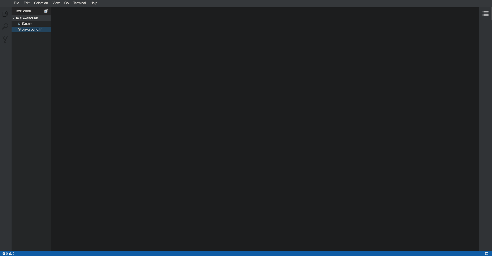

### Check terraform on instance

On the console, open a terminal and check the terraform version with the following command `terraform -v`
    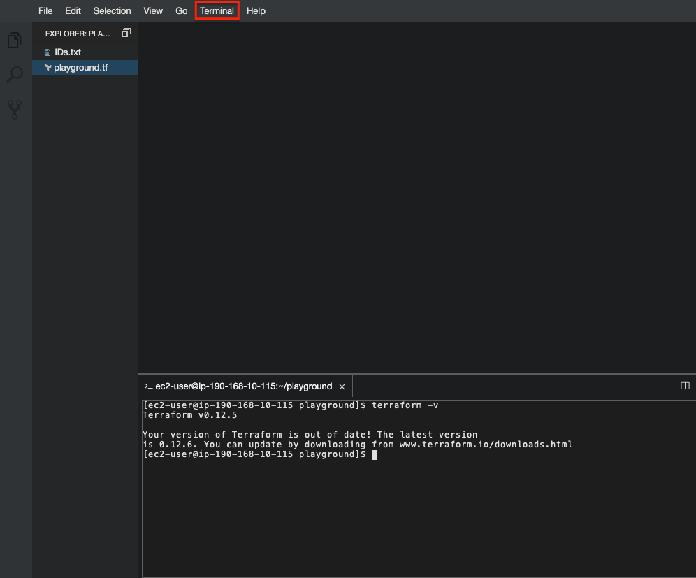

### Check ansible on instance

On the console, open a terminal and check the ansible version with the following command:

 `ansible --version`

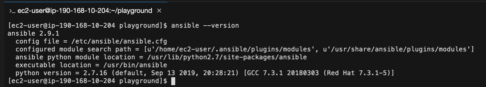

## Using terraform

* Please note that the working directory is /home/ec2-user/playground

### Running a terraform plan and apply

1. On the Theia Terminal, click the first symbol (explorer) on the left of the tool bar to bring up the list of files in the current workspace seen below.

    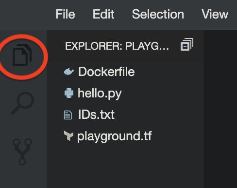

2. Open up a terminal and type terraform plan, which ought to throw the following error
    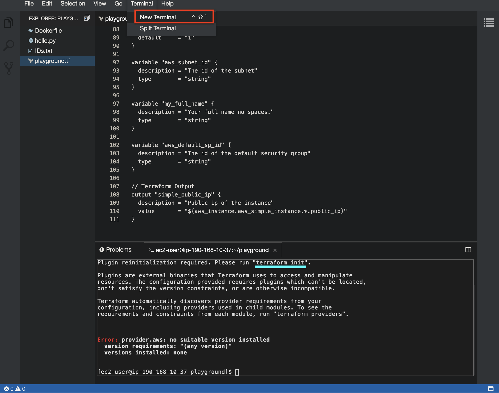

    * This is expected. For that matter, Terraform will provide the command that needs to be run to fix the error

3. Run `terraform init` and the CLI should return the following `Terraform has been successfully initialized`

    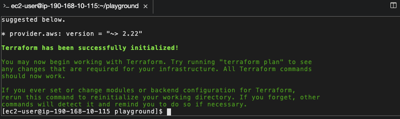

4. Run `terraform plan` again. When prompted, fill in the values requested by opening the IDs.txt file.

    * Note that for `var.my_full_name` please put in your name __WITHOUT__ whitespaces and special characters or it will throw an error.

    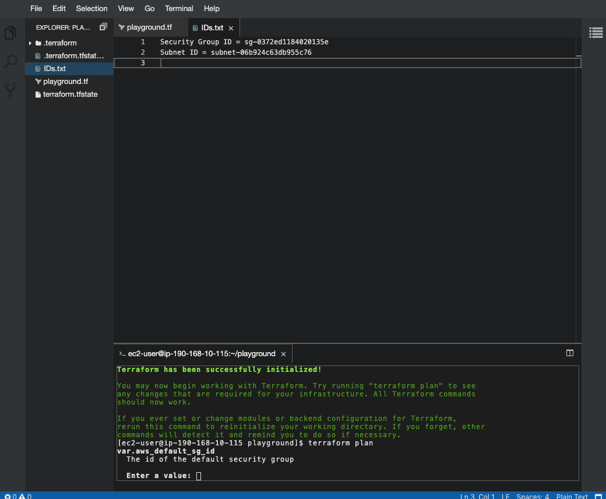

5. The output generated is a plan of what Terraform will generate.

6. Add default values for the variables `aws_subnet_id` and `aws_default_sg_id`; defined in `IDs.txt`. For the `my_full_name` variable, add your name without spaces or special characters
    ```
    variable "aws_subnet_id" {
        description = "The id of the subnet"
        type        = "string"
        default = "<IDs.txt value>"
    }

    variable "my_full_name" {
        description = "Your full name no spaces."
        type        = "string"
        default = "<your name>"
    }

        variable "aws_default_sg_id" {
        description = "The id of the default security group"
        type        = "string"
        default = "<IDs.txt value>"
    }
    ```

6. Run `terraform apply`, type yes when prompted.
    * Terraform will no longer prompt for user input for the variables.
    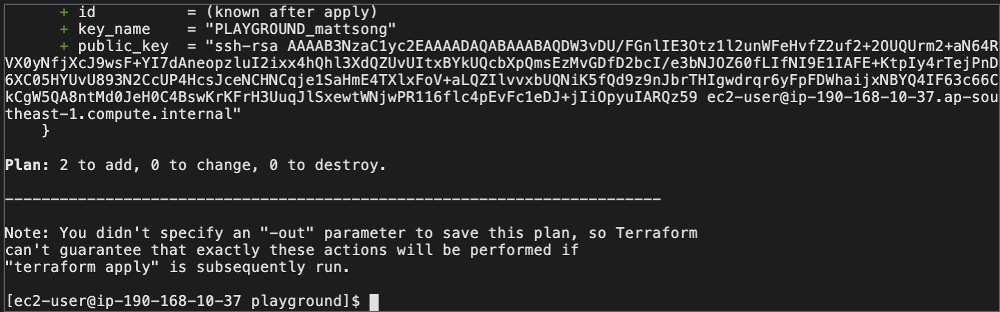

7. The CLI will return the output of the Terraform apply command defined in `playground.tf`.
    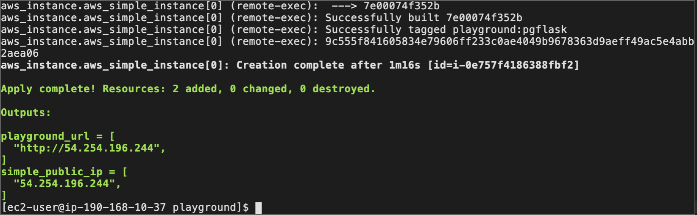

### Updating outputs and running terraform refresh 

1. To expose more values from the output, insert the following into the `playground.tf` file

    ```
    output "simple_instance_id" {
        description = "The id of the instance"
        value       = "${aws_instance.aws_simple_instance.*.id}"
    }
    ```
    Type `terraform fmt` to automatically format all .tf files for readability

    From:

    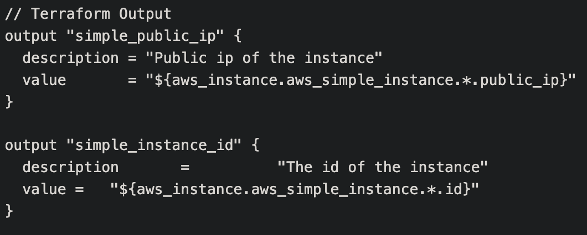

    To:

    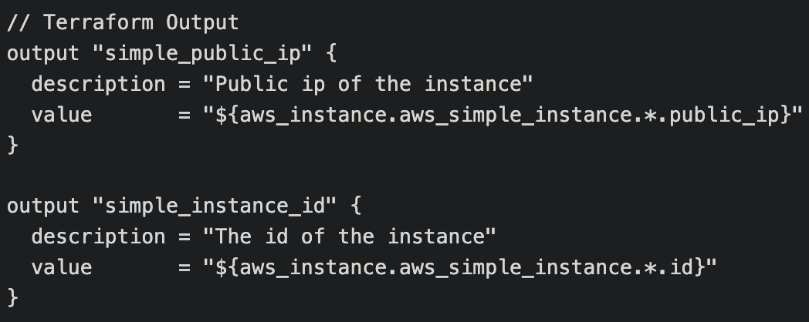

2. Typing `terraform output` will show the old output.

    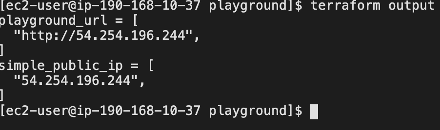

3. Type `terraform refresh`, filling in the values once again to get the new updated outputs.
    

4. Typing `terraform output` will also show the updated output.
    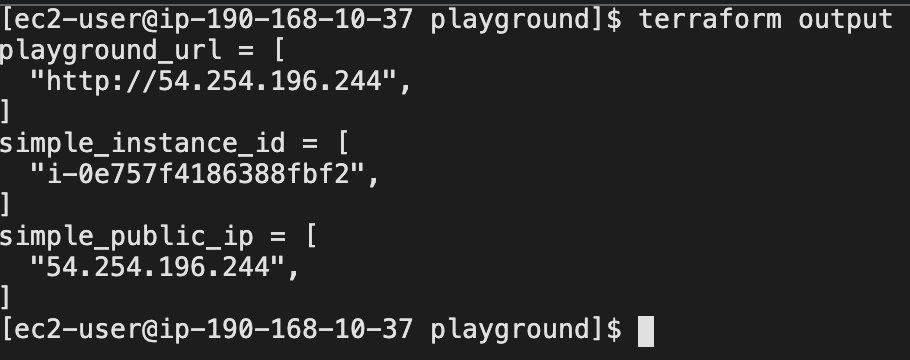

### Updating existing infrastructures with a tfvars file

On top of defining values for terraform variables by providing default values, a `terraform.tfvars` file can also be used.

1. Create a new file called `terraform.tfvars` and type `simple_instance_count_var = "2"`.

    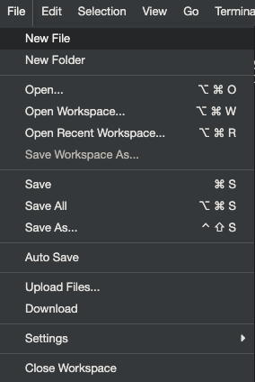

2. Run a `terraform apply` and there should be a prompt to add a resource; in this case an aws_instance resource. Type `yes`

    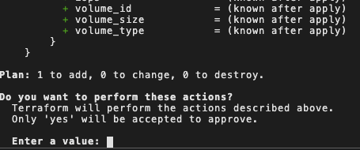

3. Once complete, there are now 2 outputs being returned instead of one.

    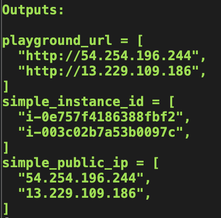

4. Likewise if the `simple_instance_count_var` is changed back to 1 and a terraform apply is run, there will be a prompt to destroy the additional resource.

    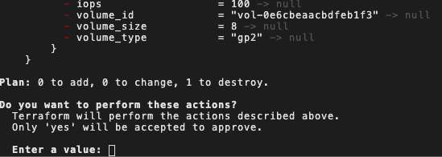

Our infrastructure is now ready. Let's configure it with Ansible!

## Using Ansible

### Create an inventory file

Ansible works against multiple managed nodes or “hosts” in your infrastructure at the same time, using a list or group of lists know as inventory. Once your inventory is defined, you use patterns to select the hosts or groups you want Ansible to run against.

In the IDE, create a new file called *hosts*

Add the following content to this newly created file, update the private ip as appropriate:

```
[lab]
server01 ansible_host=<PRIVATE IP FROM TERRAFORM OUTPUT>
server01 ansible_user=ec2-user
server01 ansible_ssh_private_key_file=~/.ssh/playground

```

Here, we are defining our instance created via terraform in a group called *lab*

### Running Ad hoc Commands

You can run Ansible commands in an Ad hoc manner without configuring any playbooks.

To test the availability of a server, we can use the *ping* module. Execute the following command:

`ansible lab -i hosts -m ping`

Output:

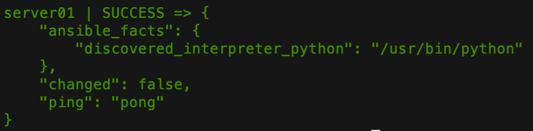


To use Ansible to copy a file to a remote server, execute:

`ansible -i hosts lab -m copy -a "src=/home/ec2-user/playground/hello.py dest=/tmp/hello.py"`

Output:

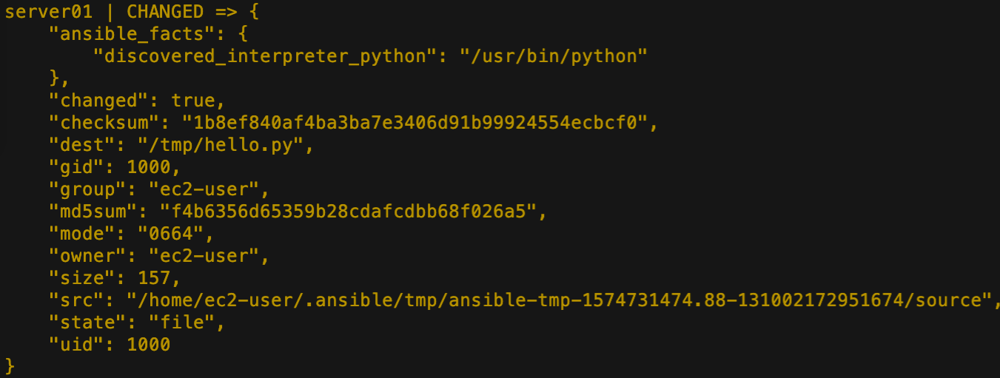

Notice in the output, `"changed": true,`

Rerun the copy command, this time you notice that `"changed": false,`:

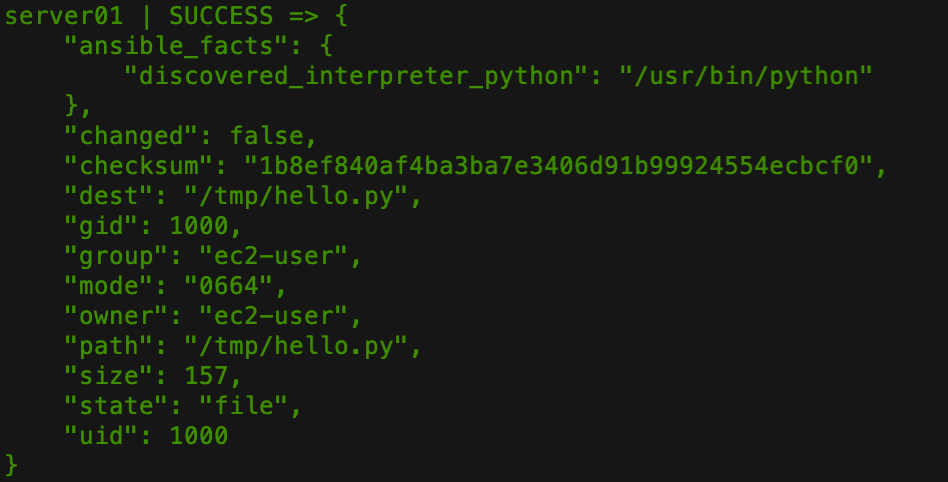

Ansible detects that the file already exists on the target server and so doesn't recopy.

### Using Roles and Playbooks

If our Ansible usage becomes more complex, we must utilise Roles and Playbooks as these offer more flexibility than ad hoc commands.

An Ansible role is an independent component which allows reuse of common configuration steps. Ansible roles have to be used within a playbook. Ansible role is a set of tasks to configure a host to serve a certain purpose like configuring a service

In your IDE, open the file *lab.yml*. This is our playbook:


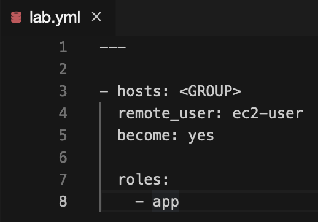

Change *\<GROUP\>* to the group lab we specified in the *hosts* file. (It is called lab)

This playbook defines the groups of hosts to run against, the ssh user to use and the roles to execute. In this case the *app* role.

Let's have a look at the app role in more detail. Expand the folder called *app*. You will see the following structure:

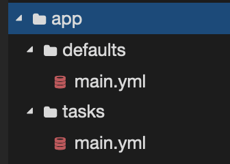

The file *defaults/main.yml* contains default variables for this role:

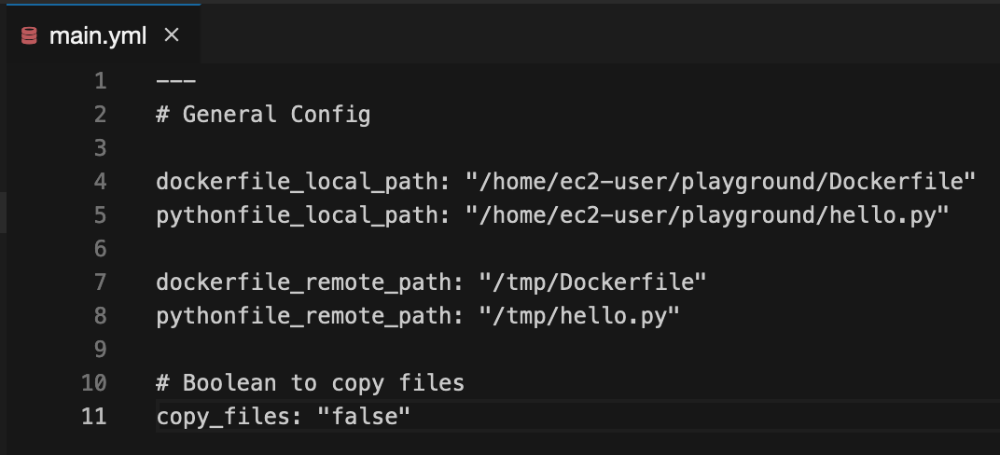

The file *tasks/main.yml* contains the instructions to run for this role. For the *app* role, we are copying two files to the target server:

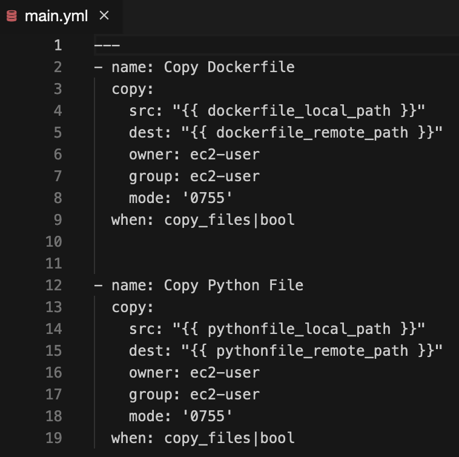

Values defined within {{ }} are variables whose values are read from *defaults/main.yml*.

Run this playbook, execute the following command:

`ansible-playbook -i hosts lab.yml`

Output:

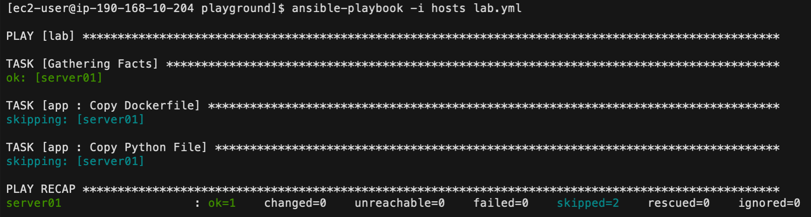

In the output we can see that Ansible skipped the copying of the Dockerfile and the Python file.

Why did it do this?

If we have a look at the *tasks/main.yml* file for the app role, we can see the following condition:

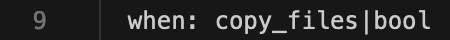

This shows that the task should execute when the condition is satisfied. 

What is the value of *copy_files*?

If we have a look at the *defaults/main.yml* file for the app role, we can see that the default value is *false*:

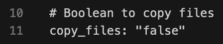

This is just an example of how conditions work in Ansible.

Change the value to *true*, and rerun the ansible command:

`ansible-playbook -i hosts lab.yml`

Output:

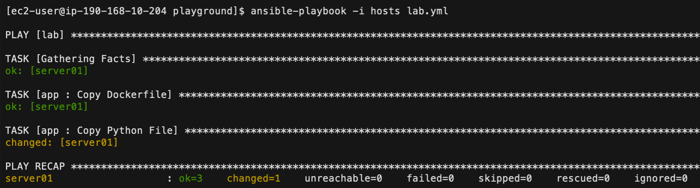

We can see no change for the Dockerfile task as we already transferred this file as part of the ad-hoc command.


Let's expand our playbook to include additional roles to deploy our *hello.py* file within a docker container.

Open *lab.yml* file and add the roles *docker* and *container*:

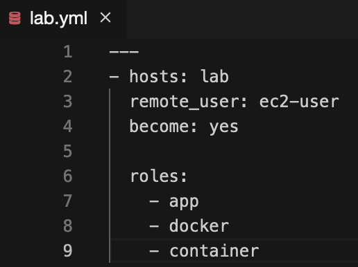

Feel free to review these roles. 

The *docker* role will install and start the Docker service on the target server.

The *container* role will build and run our python container.

Run the following ansible command:

`ansible-playbook -i hosts lab.yml`

Output:

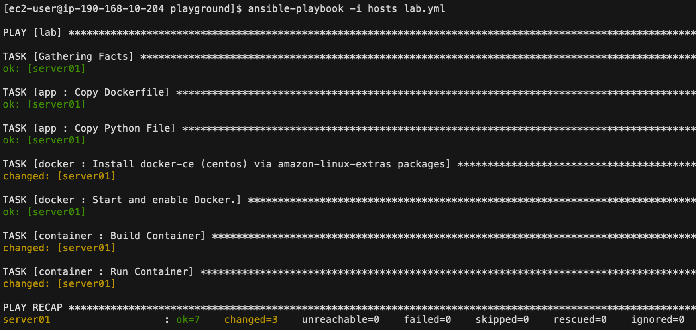

Now that our container is deployed, how do we know the public ip from our Ansible output, in order to access the container?

We can add a task to output this information.

Open file *container/tasks/main.yml* and add the following code:

```
- name: Get IP
  uri: 
    url: "http://169.254.169.254/latest/meta-data/public-ipv4"
    return_content: yes
  register: ip_result

- name: Show IP
  debug: var=ip_result
```

This will configure two additional tasks:

1. Get IP - Get ip from EC2 metadata url.
2. Show IP - Display the results.

File *container/tasks/main.yml* should look like the following:

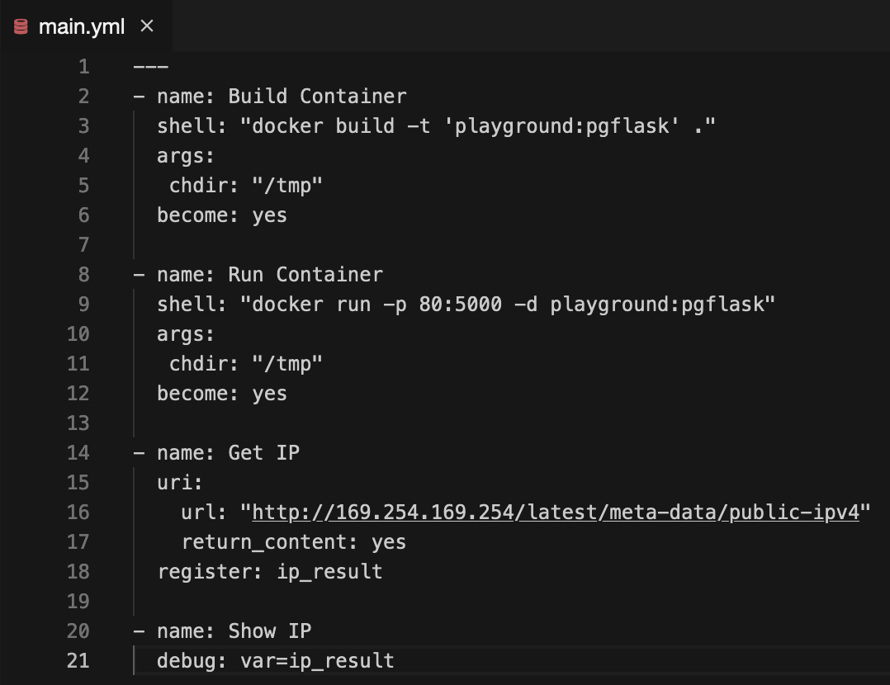


Rerun the following ansible command:

`ansible-playbook -i hosts lab.yml`

Output:

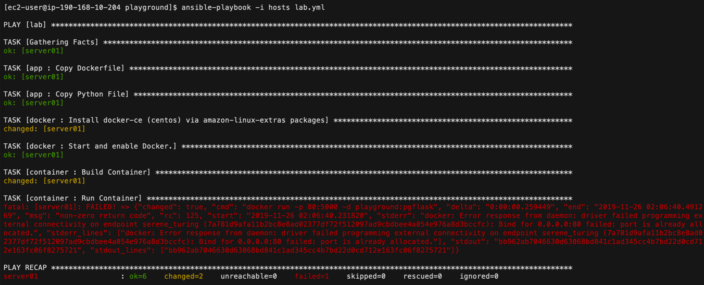

It failed! What happened?

From the output, we can see that the task *Run Container* within role *container* failed. Reading the log we are told that the container port is already in use. This makes sense as the container is already running from our previous Ansible run.

We can add a condition to skip this task.

Open file *container/tasks/main.yml* and add the following condition to the *Run Container* task:

`when: run_docker|bool`

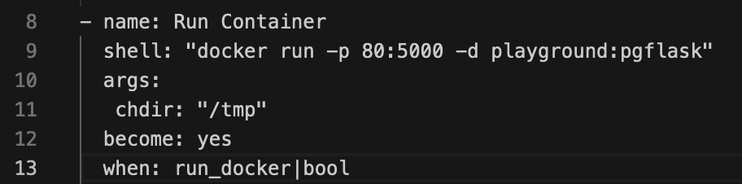

Create file *container/defaults/main.yml*

Specify a default value to the *run_docker* variable:

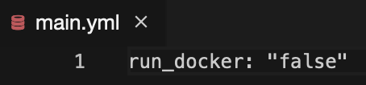

Rerun the following ansible command:

`ansible-playbook -i hosts lab.yml`

Output:

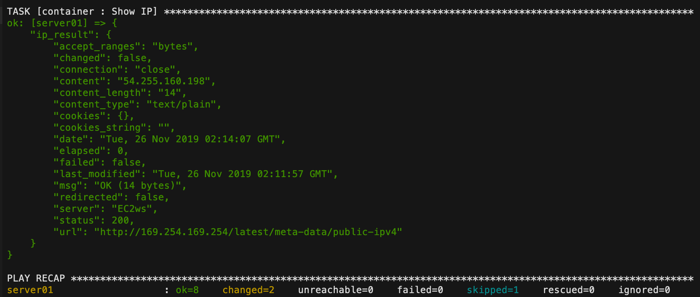

Success!

Copy the ip address from the output and open it in a new browser tab:

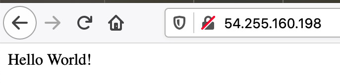


### Taking down the terraform infrastructure

1. To take down the entire infrastructure, run a `terraform destroy`.
    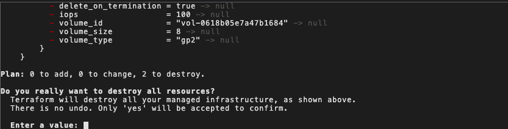

2. Once done the CLI should return the following.
    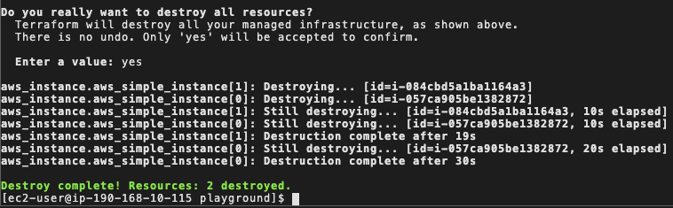

# Conclusion

In this playground, we've shown how to set up an AWS infrastructure using Terraform and configure using Ansible. We used the terraform commands `plan` and `apply` as well how to update an existing infrastructure using `refresh`. We also utilised the Asible commands `ansible` and `ansible-playbook` to apply changes to our provisioned infrastructure.

Finally, we've also gone through how to take everything down using `destroy`.

At any time, one can simply type `terraform` or `ansible` into the CLI and a list of commands will be displayed, including the ones used today.

# Terraform Training

If you would like to further your knowledge with Terraform or the Hashicorp's product suite. Consider booking a training course with one of ECS Digital's trainers.

For more information check out the link below:

https://ecs-digital.co.uk/what-we-do/training

# Resources

### Hashicorp Terraform

Product Details
https://www.terraform.io/

Documentation
https://www.terraform.io/docs/index.html


### Ansible

Product Details
https://www.ansible.com/

Documentation
https://docs.ansible.com/


# Appendix

### Setting up the Playground Environment

Ensure you have the latest version of terraform installed.

Set the following environment variables:

```
$export AWS_ACCESS_KEY_ID=<YOUR KEY ID>
$export AWS_SECRET_ACCESS_KEY=<YOUR ACCESS KEY>
```

Under modules/aws_iam_user_policy, change the <ACCOUNT_ID> in playground.json

```
"Effect": "Allow",
"Action":"ec2:RunInstances",
"Resource": [
    "arn:aws:ec2:ap-southeast-1:<ACCOUNT_ID>:network-interface/*",
    "arn:aws:ec2:ap-southeast-1:<ACCOUNT_ID>:volume/*",
    "arn:aws:ec2:ap-southeast-1:<ACCOUNT_ID>:key-pair/*",
    "arn:aws:ec2:ap-southeast-1:<ACCOUNT_ID>:security-group/*",
    "arn:aws:ec2:ap-southeast-1:<ACCOUNT_ID>:subnet/*"
]
```

Navigate to the _setup directory and execute:

```
$terraform init
```

Then execute:
```
$terraform plan
```

Finally, apply the plan:

```
$terraform apply
```


### Tearing down the Playground Environment

Navigate to the _setup directory and execute:

```
$terraform destroy
```